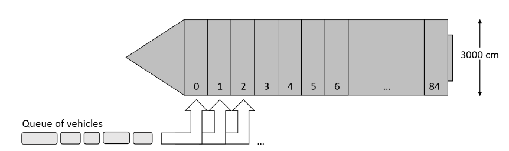
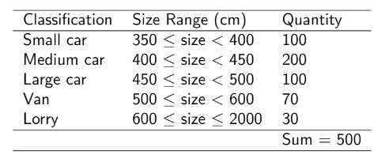

# Ferry-Loading-Optimizer

# Hackathon Statement:

# Summary

In this coursework you are to write a program that attempts to solve a problem involving loading vehicles on to a ferry. Your program will read in a problem instance from a file and will produce a solution using various simple optimisation techniques. You are also encouraged to alter various parameters to investigate the nature of the problem and your algorithm(s). Good programs will output information to the user during and after a run, and include graphical output.

# Problem Specification

A large ferry is used to transport vehicles across an estuary. To load the ferry, the whole of one side of the boat is lowered, and each vehicle is instructed to drive into a particular lane. The ferry consists of 85 lanes in total (labelled 0 to 84) and each lane has a capacity (length) of 3,000 cm, as illustrated in the following diagram:

Currently the company that operates the ferry uses a very simple queueing system. Vehicles of varying lengths arrive at the port one-by-one and join a single queue. When the time comes to load the ferry, each vehicle is taken from the queue one at a time (in order) and is instructed to drive into the lowest-indexed lane that currently has sufficient capacity for the vehicle. If there are no lanes with sufficient capacity, the vehicle is sent to an overspill car park and is not allowed to board the ferry. Once this vehicle has been dealt with, the next vehicle in the queue is considered in the same way. This continues until all vehicles have been considered.

It is obviously in the ferry company's interest to minimise the amount of wasted lane-space in each ferry crossing. Hence our aim is to minimise the total length of the vehicles assigned to the overflow car park. This is equivalent to maximising the total length of all vehicles.from the queue that are allowed to enter the ferry.

# Problem Instances and Code

You have been supplied with example instance of this problem in input.txt. The first two lines of this file contain the length of each lane (3,000 cm) and the number of lanes (85), respectively. This is then followed by the (integer) lengths of 500 vehicles (in cm), in the order that they have joined the queue. Sizes of vehicles in this instance have been generated randomly according to the numbers in the following table. In each case, the size of vehicles belonging to each class have been generated uniform randomly in the given ranges.

You have also been supplied with some Python code that reads in this problem instance and assigns the vehicles to lanes using the process described above. In this code

* The variables c and numlanes are used to store the lane capacity and number of lanes respectively:

* The list L is used to hold the lengths and order of all vehicles in the queue

* The list of lists S is used to hold the vehicle lengths assigned to each lane in the ferry (the total of each lane cannot exceed c);

* The list O is used to store all vehicle lengths that have been assigned to the overflow car park.

* The function get.First Lane is used to determine the lane for each vehicle. If no lane is suitable for a

vehicle due to insufficient capacity, the function returns -1.

Download the above files onto your computer (putting them into the same folder) and get them running. Ensure that you understand what each line of code is doing.

# TASK 1

As noted, the current strategy for choosing a lane is to use the lowest-indexed lane that has sufficient capacity for the vehicle. However, it has been suggested that some other strategies might be more appropriate. These include, for each vehicle:

1. Choosing the emptiest lane with sufficient capacity for the vehicle;

2. Choosing the fullest lane with sufficient capacity for the vehicle;

3. Choosing any random lane with sufficient capacity for the vehicle;

where "emptiest" and 'fullest" are determined using the total length of all vehicles currently assigned to a lane.

Using the function getFirst Lane in the supplied code as a guide, program the above rules (and perhaps others) and investigate their effects on the quality of your solution.

* At the start of a run, you may wish to ask the user which of the above rules they want to use to load the ferry. In addition to text output, you may also wish to use various graphical outputs (charts) to illustrate your solutions. These can also be included in your report, if desired.